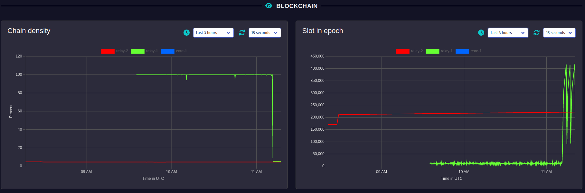

layout: page
title: "Threepenny-GUI"

# What is it?

Threepenny-gui is a GUI framework that uses the web browser as a display.

Features include:
* **Easy installation** — Everyone has a reasonably modern web browser installed. Just install the library from hackage and you are ready to go. The library is cross-platform.
* **HTML** + **JavaScript** — You have all capabilities of HTML at your disposal when creating user interfaces. This is a blessing, but it can also be a curse, so the library includes a few layout combinators to quickly create user interfaces without the need to deal with the mess that is CSS. A foreign function interface (FFI) allows you to execute JavaScript code in the browser.
* [Functional Reactive Programming][frp] (**FRP**) — promises to eliminate the spaghetti code that you usually get when using the traditional imperative event-based style for programming user interactions. Threepenny has an FRP library built-in, but its use is completely **optional**. Employ FRP when it is convenient and fall back to the traditional style when you hit an impasse.

  [frp]: https://wiki.haskell.org/Functional_Reactive_Programming

Stability: The library API is still in flux, significant API changes are likely in future versions. The goal is make GUI programming simple, and that just needs some experimentation.

# What is it not?

As cool as Threepenny may be, it is ...

* ... not a web front-end. The server is meant to be run from localhost. Latency would be too high to use it as a web app. That said, it's perfectly stuitable for implementing multi-user apps on a local network, see the [Chat.hs example][chat].
* ... not a JavaScript or HTML library. It's a GUI framework with a Haskell API and abstracts many aspects of the document object model. While some basic HTML skills are needed, no knowledge of JavaScript is required to use Threepenny, though you can include external client libraries if you really want to.

If you want to write a web app, have a look at projects like [Fay][fay], [GHCJS][ghcjs] and [ Haste][haste]. That said, the Threepenny API may be ported to some of these projects as well in the future, but that is not the focus right now.

   [chat]: https://github.com/HeinrichApfelmus/threepenny-gui/blob/master/samples/Chat.hs
   [ghcjs]: https://github.com/ghcjs/ghcjs
   [fay]: https://github.com/faylang/fay/wiki
   [haste]: https://github.com/valderman/haste-compiler

# Gallery

Applications written with Threepenny.

<table>
<tr>
<td>
<a href="http://fluffynukeit.com/?page_id=535">Daniel Austin's <b>FNIStash</b></a>
 Editor for <a href="http://en.wikipedia.org/wiki/Torchlight_II">Torchlight 2</a> inventories.
 
<td>
<a href="https://github.com/duplode/stunts-cartography">Daniel Mlot's <b>Stunts Cartography Track Viewer</b></a>
 Map viewer for the <a href="http://scr.stunts.hu/">Stunts</a> racing game.
 

<tr>
<td>
<a href="https://github.com/blitzcode/hue-dashboard">Tim Schröder's <b>Hue Dashboard</b></a>
 Control smart lights (<a href="http://www2.meethue.com/en-us">Philips Hue</a>)
 
<td>
<a href="https://wiki.haskell.org/Hoed">Maarten Faddegon's <b>Hoed</b></a>
 A lightweight tracer and algorithmic debugger for Haskell
 

<tr>
<td>
<a href="https://github.com/CarstenKoenig/Holidays2013">Carsten König's holiday project</a>
 Small viewer for the Mandelbrot set.
 
<td>
<a href="https://github.com/Chaddai/CurveProject">Chaddai's <b>CurveProject</b></a>
 Plotting curves for math teachers.
 

<tr>
<td colspan="2">
<a href="https://github.com/input-output-hk/cardano-node/blob/master/cardano-tracer/docs/cardano-rtview.md"><b>Cardano RTView</b></a>
 Real-time monitoring tool for <a href="https://docs.cardano.org/cardano-components/cardano-node">Cardano</a> nodes.
 
<td>
</table>

# Resources

* Package

  * [threepenny-gui package on Hackage](https://hackage.haskell.org/package/threepenny-gui)
  * [threepenny-gui source code on Github](https://github.com/HeinrichApfelmus/threepenny-gui/)

* Documentation

  * [API reference](http://hackage.haskell.org/package/threepenny-gui)
  * *[Examples](../samples#readme)*
  * [Tutorial slides from HaL 2017](../doc/hal-2017)
  * [A work in progress tutorial](https://github.com/yuvallanger/threepenny-gui/blob/tutorial/samples/BarTab.lhs) by [Yuval Langer](https://github.com/yuvallanger) - help will be dearly appreciated.
  * [Developer Blog](http://apfelmus.nfshost.com/blog.html#gui-programming )

* Feedback and Contact

  * Maintainer: [Heinrich Apfelmus](http://apfelmus.nfshost.com/)
  * Bugs and feature requests? [Issue Tracker!](https://github.com/HeinrichApfelmus/threepenny-gui/issues)
  * Questions? [Ask on StackOverflow!](http://stackoverflow.com/questions/ask?tags=haskell+threepenny-gui+gui)
